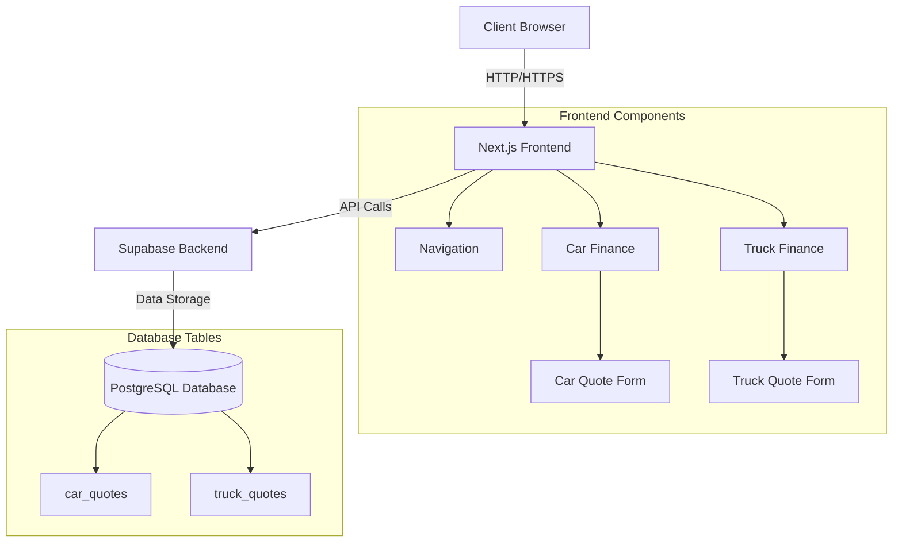

# Vehicle Finance Application Documentation

## Overview
The Vehicle Finance Application is a modern web application built with Next.js that provides users with the ability to apply for car and truck financing. The application features a multi-step form process, real-time quote generation, and integration with Supabase for data storage.

## Architecture



## Tech Stack
- **Frontend Framework**: Next.js with React
- **Styling**: Tailwind CSS with custom components
- **Animation**: Framer Motion
- **Backend/Database**: Supabase (PostgreSQL)
- **Authentication**: Supabase Auth (planned)
- **Fonts**: Poppins, Inter

## Project Structure
```
├── app/
│   ├── components/
│   │   ├── Navigation.tsx
│   │   └── ...
│   ├── car-finance/
│   │   ├── page.tsx
│   │   └── quote/
│   │       └── page.tsx
│   ├── truck-finance/
│   │   ├── page.tsx
│   │   └── quote/
│   │       └── page.tsx
│   └── layout.tsx
├── lib/
│   ├── supabase.ts
│   └── utils/
│       └── security.ts
├── public/
│   └── assets/
└── docs/
    ├── README.md
    ├── database-schema.md
    ├── form-validation.md
    └── quote-calculation.md
```

## Key Features
1. Multi-step form process for both car and truck finance applications
2. Real-time quote generation based on user inputs
3. Dark/Light mode support
4. Responsive design for all screen sizes
5. Form validation and eligibility checks
6. Secure data storage in Supabase
7. Modern UI with smooth animations

## Form Flow
1. **Step 1**: Personal Information
   - Name
   - Contact details
   - Email
   - (Additional business details for truck finance)

2. **Step 2**: Vehicle Details
   - Vehicle type/make/model
   - Cost
   - Down payment
   - Loan term

3. **Step 3**: Financial Information
   - Monthly income/revenue
   - Employment type/Business age
   - Credit score

## Quote Generation Process
1. Eligibility Check
2. Interest Rate Calculation
3. Loan Amount Computation
4. Monthly Payment Calculation
5. Quote Storage in Database
6. Result Presentation

## Security Measures
- Input sanitization
- Data validation
- Secure API endpoints
- Database access control
- Error handling

## Performance Considerations
- Optimized form rendering
- Progressive form loading
- Efficient state management
- Minimal database queries
- Responsive image loading

## Future Enhancements
1. User authentication and profiles
2. Document upload capability
3. Real-time credit score integration
4. Multiple vehicle comparison
5. EMI calculator integration
6. Admin dashboard
7. Payment gateway integration
8. Application status tracking

## Development Guidelines
1. Follow TypeScript best practices
2. Maintain consistent code formatting
3. Write comprehensive comments
4. Use meaningful variable names
5. Implement proper error handling
6. Add unit tests for critical functions
7. Keep documentation updated

## Deployment
The application is designed to be deployed on Vercel or similar platforms that support Next.js applications. Environment variables should be properly configured for production deployment.

## Contributing
Please refer to the contribution guidelines in the repository for information on how to contribute to this project.

## Support
For technical support or queries, please contact the development team or raise an issue in the repository. 